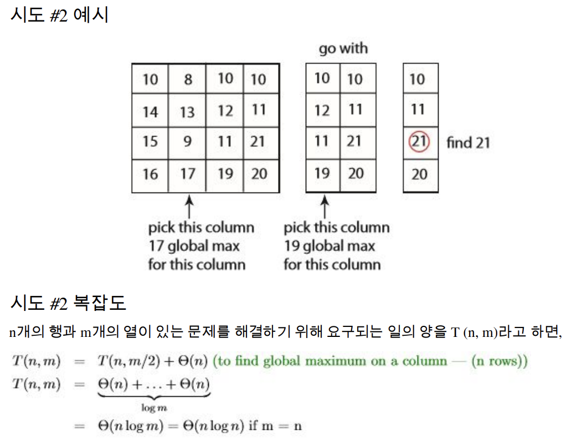

---

## 목차

- [Introduction](#introduction)

 

--- 

## Introduction

### 01. 2차원에서 극댓값을 찾는 알고리즘과 복잡도를 설명해주세요

&nbsp;&nbsp;&nbsp;&nbsp;  

- 분할 정복을 통해서 최댓값을 찾습니다
- 먼저 중앙 열j 에서 최댓값을 찾습니다 (1)
- 다음으로 (i, j − 1), (i, j), (i, j + 1)를 비교해서 왼쪽이 크거나 오른쪽이 클경우 이동합니다 (2)
- 행을 한 번 이동하면 1,2번 과정을 반복합니다
- 복잡도는 먼저 1차원 분할 정복의 경우 **Θ(log n)**이고  2차원의 경우 m개의 열중 최댓값을 1차원 과정마다 한번식 골라야하기 때문에 **Θ(nlog m)** 이 됩니다  

#

### 02. 자료구조적인 관점에서 RAM이란 무엇인가요?

&nbsp;&nbsp;&nbsp;&nbsp;  

- 자료구조적인 관점으로 보면 RAM은 거대한 배열로 만들어진 저장 공간입니다
- 각 word의 복잡도는 Θ(1)입니다  

#

### 03. 자료구조적인 관점에서 Pointer Machine 이란 무엇인가요?

&nbsp;&nbsp;&nbsp;&nbsp;  

- Pointer Machine은 매우 간단한 형태의 객체지향 프로그래밍입니다.
- 동적으로 할당된 객체들은 각각 일정한 개수의 필드를 가집니다. 이때 필드는 워드가 될 수도 있고  포인터가 될 수 있습니다
- 이때 포인터는 다른 주소를 참조하거나 null을 참조할 수 있습니다, 즉 2개의 노드를 가진 이중연결 리스트입니다. 이것이 포인터 머신입니다.
- 이러한 객체(노드)는 Θ(1)의 복잡도를 가지게 됩니다  

#

### 04. RAM과 Pointer Machine을 파이썬에 적용한다면 어떻게 되나요?

&nbsp;&nbsp;&nbsp;&nbsp;  

- 파이썬의 list(배열)는 Ram이라고 할 수 있습니다. L[i] = L[j]+5 은 상수시간(Θ(1))이 걸리기 대문입니다
- 포인터 머신은 . O(1)개의 속성(참조 포함)을 가진 객체라고 생각할 수 있습니다.  → x = x.next → Θ(1) 시간  

#
